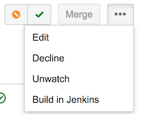
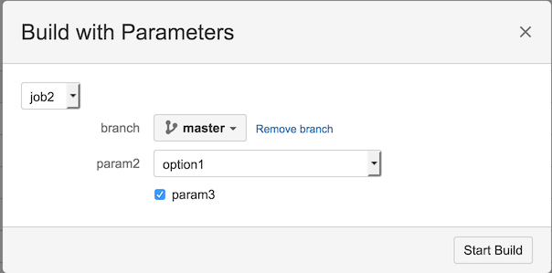

## Welcome to the Jenkins Parameterized Build Plug-in
[](https://travis-ci.org/KyleLNicholls/parameterized-builds)

## Setup
1. [Define a server](#define-a-server)
2. [Define a job](#define-a-job)
3. [Link your bitbucket server account to Jenkins](#link-your-bitbucket-server-account-to-jenkins)

#### Define a server
Jenkins servers can be defined globally on the Administration page of Bitbucket Server
or per project on the project settings page.

  
* `Base URL` should be the http/https root address to you jenkins server
* `Default User` and `Default Token` are optional and used as a fall back 
authentication for triggering jobs
* [Build Token Root Plugin](https://wiki.jenkins-ci.org/display/JENKINS/Build+Token+Root+Plugin) 
uses an alternate alternate address for triggering builds anonymously 
 * enable this only if you have this plugin installed in Jenkins

#### Define a job
  
  
Enable Parameterized Builds for Jenkins under the hooks settings for a repository.  
You can add as many jobs as you want (within reason), 
they will be triggered in the order they are added.
* `Job Name`
* `Ref Type` will apply your triggers to either branch operations or tag operations
* [Triggers](#triggers)
* `Token` correspondes to the authorization token on your job configuration page in Jenkins
* [Build Parameters](#build-parameters)
* `Ref Filter` uses java regex syntax to only trigger a 
build for branches/tags that match the filter
  * the filter will only be used for branch/tag creation, branch pushes, and branch/tag deletion
  * leave blank to match all branches
* `Monitored Paths` will only trigger a build if a file in the diff matches the filter
  * the filter will only be used for branch pushes and PR events
  * leave blank to match all changes
* `Required Build Permission` will restrict who can trigger a Jenkins job using the repository permissions
  * This is only available on manual triggers

#### Link your bitbucket server account to Jenkins
  
On your user account page you can add your Jenkins API token.
When added bitbucket server will use your Jenkins account 
to trigger jobs for branches you create/push, pull requests you open, or for manual builds.  
If you have multiple Jenkins servers setup you can set the api token for each one.

Order of authentication:  
The Jenkins user `Token` from the Jenkins User Settings will be used for authentation first.  
If that is not set then the `Token` parameter in the job configuration will be used second.  
If that is not set then the `Default User` and `Default Token` on the Jenkins 
server settings page will be used.


## Triggers
 

You can use any combination of triggers.
* `REF CREATED`
  * triggers a build for branch or tag creation events
  * the branch or tag name must match the `Ref Filter` parameter (leave blank to match all)
* `PUSH EVENT`
  * triggers a build for branch push events to the repository
  * the branch must match the `Ref Filter` parameter (leave blank to match all)
  * the files modified in the commits must match the `Monitored Paths` parameter (leave blank to match all)
* `MANUAL`
  * will add a "Build in Jenkins" button in the branch context menu and pull request page in bitbucket server  
 


  * if you have multiple jobs with the `MANUAL` trigger then the user will be prompted to choose which job to trigger  

  * the user can also edit the build parameters before triggering the job
* `REF DELETED`
  * triggers a build for branch or tag deletion events
  * the branch or tag name must match the `Ref Filter` parameter (leave blank to match all)
* `AUTO MERGED`
  * triggers a build for automatic merge events
  * the files modified in the PR must match the `Monitored Paths` parameter (leave blank to match all)
* `PR OPENED`
  * triggers a build for pull request creation events
  * triggers a build if the pull request is re-opened
  * triggers a build if the pull request is pushed to
  * the files modified in the PR must match the `Monitored Paths` parameter (leave blank to match all)
* `PR MERGED`
  * triggers a build for pull request merge events
  * the files modified in the PR must match the `Monitored Paths` parameter (leave blank to match all)
* `PR DECLINED`
  * triggers a build for pull request declined events
  * the files modified in the PR must match the `Monitored Paths` parameter (leave blank to match all)
* `PR DELETED`
  * triggers a build for pull request declined events
  * the files modified in the PR must match the `Monitored Paths` parameter (leave blank to match all)


## Build Parameters
```
branch=$BRANCH  
environment=dev;test;prod
boolean=true
```
Build parameters can be specified using key=value pairs.  
You can use predefined variables that will be replaced when the build is triggered. 
For example `branch=$BRANCH` will replace $BRANCH with the branch name that triggered the build.  
Built-in variables: 
* $BRANCH: the branch name or tag name that triggered the build (without refs/heads/ or refs/tags/)
* $COMMIT: the commit hash that triggered the build 
* $REPOSITORY: the repository slug
* $PROJECT: the project key
* $TRIGGER: the trigger that triggered the build
* PR-specific variables (only availably when using a 'PR' prefixed trigger)
  * $PRID: bitbucket id of the PR
  * $PRDESTINATION: name of the destination branch in the PR
  * $PRTITLE: title of the PR
  * $PRDESCRIPTION: description of the PR (may be empty)
  * $PRAUTHOR: display name of the author of the PR
  * $PRURL: bitbucket URL of the PR

Parameter Types:
* string: `key=value`
* choice: `key=option1;option2;option3`
  * when using the `MANUAL` trigger users will be prompted with a dropdown list of the choices
  * separate each choice with a semicolon
  * `option1` will be the default for push events
* boolean: `key=true`
  * when using the `MANUAL` trigger users will be prompted with a checkbox
  * `true` will be the default, use `key=false` to make false the default  
 
 
# Contributing
* Pull requests should be opened against master
* Write unit tests for any changes you make
* A passing [Travis CI](https://travis-ci.org/KyleLNicholls/parameterized-builds) build is required
